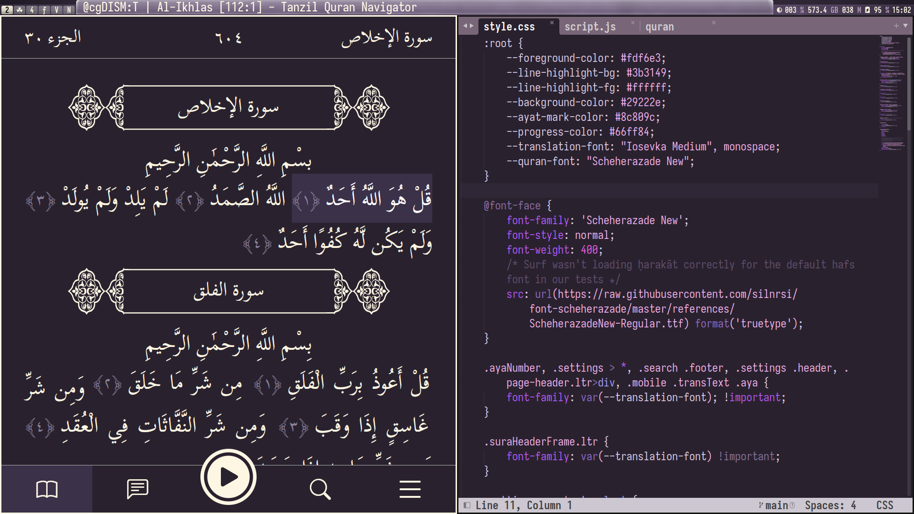

# tanzil-surf

I created this for personal use in order to read/play Quran in a client that appears more or less native in my window manager configuration. All of the real work has been done by the teams at [Tanzil.net](https://tanzil.net) and [Suckless.org](https://suckless.org). 

## Screenshot

## Details

A custom js user script is included to trigger the more minimalistic, "mobile" layout of the site, as for some reason setting the user agent to that of a mobile device to force this did not work in surf as it does in other browsers. If run without this script, the preference can be toggled manually and is stored in `~/.surf/cache` for future sessions regardless.

This layout is well suited to virtually any window size or aspect ratio on my system, though some customization may be necessary on other environments with respect to mechanics of the script, flags by which surf is called therein, the stylesheet, etc.

While the default font used by Tanzil displays well in other browsers, I did not find it to display vowel diacritics correctly in surf. I am therefore overriding it with Scheherazade New, which is more readable here, though any other Arabic font can be substituted in the stylesheet relatively easily.

By default, the color scheme is suited to my system. I am not a web developer, but I have accomodated for portability to some extent by cleaning up the CSS and allowing anyone to modify the variables easily in the first two sections. 

## Dependencies

- Install the [surf](https://surf.suckless.org/) browser from Suckless.org
- The script was written for and tested on an environment using bash 5.1
- **Note for users on Debian-based systems:** for some reason on my AMD machine running Linux Mint, I was getting *"amdgpu.ids: Permission denied"* errors when trying to run surf from the package repositories. Compiling from source resolved the issue; to do so, you may need **libwebkit2gtk-4.1-dev** and **libgcr-3-dev**

## Usage

- Script takes one optional argument in the form of a *sūrah* and an *āyah* in the form of two numbers separated by a colon. For example, *10:47*. 
- If no argument is provided, Tanzil.net tends to serve the page most recently viewed and surf does a fine job at caching it. 